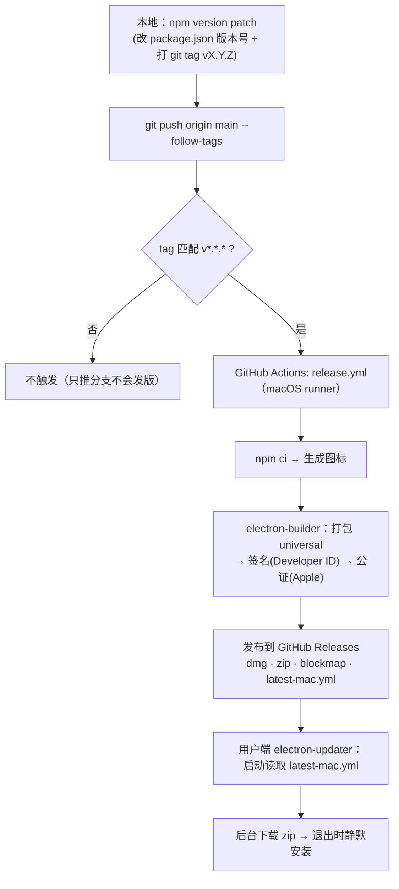

# 发版手册（签名 · 公证 · 自动更新）

> 面向维护者与接手的 AI。**发版的唯一正规路径是打 tag 触发 GitHub Actions**，本地脚本仅作应急兜底。
> 动手前请通读「注意事项」与「铁律」两节。

- 仓库：`DamonAmber/kiro-task-monitor`
- 打包：electron-builder → 产 `universal` 的 `.dmg`（首次安装）+ `.zip`（自动更新）
- 签名：Developer ID Application 证书；公证：Apple notary
- 分发：GitHub Releases；客户端 electron-updater 每次启动检查、后台下载、退出时安装

## 流程总览



> 凭据（签名证书 / 公证 / 发布）全部走 GitHub Secrets，见第三节；本地 `.env` 仅用于应急发版。

---

## 一、日常发版（正规路径）

前提：GitHub Secrets 已配好（见第三节，已配置完成，通常无需再动）。

```bash
# 1) 抬版本号：自动改 package.json + 生成 git tag vX.Y.Z（两者保持一致，关键）
npm version patch          # 兼容修复；功能用 minor；破坏性用 major

# 2) 推代码 + 推 tag（tag 才是触发器；漏了 --follow-tags 不会发版）
git push origin main --follow-tags
```

推送 `vX.Y.Z` 形式的 tag 后，`.github/workflows/release.yml` 自动在 macOS runner 上完成
**安装依赖 → 生成图标 → 签名 → 公证 → 打包 → 发布到 Releases**。用户端下次启动自动升级。

> 首次发布（版本已是 0.1.0、无需抬版本）用过：`git tag v0.1.0 && git push origin v0.1.0`。

### 验证发版是否成功
```bash
# 看最近一次运行的分步状态（应全绿，关键步骤：打包·签名·公证·发布）
gh run list  --repo DamonAmber/kiro-task-monitor --limit 3 \
  --json databaseId,status,conclusion,headBranch
gh run view --job=<jobId> --repo DamonAmber/kiro-task-monitor

# 从日志确认已签名 + 公证成功（应看到 signing / "notarization successful" / publishing）
gh run view --job=<jobId> --repo DamonAmber/kiro-task-monitor --log \
  | grep -iE "signing|notariz|publish"

# 确认 Release 非草稿且产物齐全（dmg / zip / 两个 blockmap / latest-mac.yml）
gh release view vX.Y.Z --repo DamonAmber/kiro-task-monitor \
  --json isDraft,isPrerelease,assets
```

---

## 二、注意事项 / 常见坑

1. **版本号必须与 tag 一致**。electron-builder 按 `package.json` 的 `version` 生成 Release（名为 `vX.Y.Z`）。
   永远用 `npm version` 来同时改号+打 tag，别手动只打 tag 或只改号，否则 Release 与 tag 对不上。
2. **只推 tag 才会发版**。`git push` 不带 tag 不触发；务必 `--follow-tags`（或单独 `git push origin vX.Y.Z`）。
3. **`releaseType: release`（见 electron-builder.yml）**：Release 直接公开。electron-updater 不认草稿/预发布，
   所以若改成 `draft` 做审阅门禁，记得手动点 Publish 后用户才收得到更新。
4. **不要更改 `appId`（`com.damonamber.kiro-task-monitor`）**。它是 app 身份，一旦改动：
   老用户的「辅助功能 / 自动化」授权会失效需重授，自动更新的身份连续性也会断。同理别改 `productName` 的 .app 名。
5. **公证凭据会过期**：`APPLE_APP_SPECIFIC_PASSWORD` 可能被吊销、`Developer ID` 证书有效期约 5 年。
   过期后 CI 的公证/签名步骤会失败，按第三节重建对应 Secret。
6. **universal 包较大**（dmg ~170MB）。只面向 Apple Silicon 可把 `electron-builder.yml` 的
   `arch: [universal]` 改为 `[arm64]` 以减小体积、加快构建。
7. **Actions 里的 Node 20 弃用告警是无害提示**，不影响构建；介意可把 `setup-node` 的 `node-version` 抬高。
8. **本地 `git push` 认证**：本机用 `gh` CLI（已登录 `DamonAmber`）。若直接 `git push` 提示认证，
   跑一次 `gh auth setup-git` 即可长期免密；或用一次性：
   `git -c credential.helper='!gh auth git-credential' push ...`。
9. **`.env` 只用于本地兜底发版，永不提交**（已在 `.gitignore`）。CI 用的是 GitHub Secrets，二者独立。

---

## 三、GitHub Secrets：清单与重建方法

CI 需要以下 Secrets（发布用的 token 走 Actions 内置 `GITHUB_TOKEN`，**无需**自建 PAT）：

| Secret | 含义 |
|--------|------|
| `APPLE_ID` | Apple ID 邮箱 |
| `APPLE_APP_SPECIFIC_PASSWORD` | App 专用密码（appleid.apple.com › 登录与安全） |
| `APPLE_TEAM_ID` | 10 位团队 ID（本项目为 `MA5G62M45A`） |
| `CSC_LINK` | Developer ID 证书导出的 `.p12` 的 **base64** |
| `CSC_KEY_PASSWORD` | 上面 `.p12` 的导出密码 |

查看已有：`gh secret list --repo DamonAmber/kiro-task-monitor`

### 重建三个 Apple 凭据
```bash
R=DamonAmber/kiro-task-monitor
printf '%s' 'you@example.com'      | gh secret set APPLE_ID --repo $R
printf '%s' 'xxxx-xxxx-xxxx-xxxx'  | gh secret set APPLE_APP_SPECIFIC_PASSWORD --repo $R
printf '%s' 'MA5G62M45A'           | gh secret set APPLE_TEAM_ID --repo $R
```
> 用 `printf '%s' | gh secret set`（从 stdin 读），避免把明文打进命令历史/日志。

### 重建签名证书 Secret（`CSC_LINK` / `CSC_KEY_PASSWORD`）
前提：本机「登录」钥匙串里有 `Developer ID Application` 证书（含私钥）。
确认：`security find-identity -v -p codesigning`（应看到 `Developer ID Application: Damon Wang (MA5G62M45A)`）。

```bash
R=DamonAmber/kiro-task-monitor
P12=/tmp/cert.p12; PW=$(openssl rand -base64 24)

# 1) 从钥匙串导出证书+私钥为 .p12（可能弹钥匙串授权框，点“允许/始终允许”）
security export -k "$HOME/Library/Keychains/login.keychain-db" \
  -t identities -f pkcs12 -P "$PW" -o "$P12"

# 2)（建议）用临时钥匙串验证 p12 能产出恰好 1 个可签名身份
KC=/tmp/verify.keychain-db; KCPW="tmp-$(openssl rand -hex 6)"
security create-keychain -p "$KCPW" "$KC"; security unlock-keychain -p "$KCPW" "$KC"
security import "$P12" -k "$KC" -P "$PW" -T /usr/bin/codesign >/dev/null 2>&1
security find-identity -v -p codesigning "$KC" | grep "Developer ID Application"
security delete-keychain "$KC"

# 3) 写入 Secrets（base64 走 stdin，不落盘明文），随后清理
base64 -i "$P12"      | gh secret set CSC_LINK --repo $R
printf '%s' "$PW"     | gh secret set CSC_KEY_PASSWORD --repo $R
rm -f "$P12"
```
> OpenSSL 3 直接读这个 `.p12` 可能报错（旧式加密），属正常；以「临时钥匙串导入成功」为准。

### 获取 Developer ID Application 证书（若本机没有）
Xcode › Settings › Accounts › 选中 Apple ID › Manage Certificates › 左下 `+` ›
选 **Developer ID Application**；生成后自动进「登录」钥匙串。

---

## 四、本地应急发版（兜底，非常规）

CI 不可用时可在本机发版（需 `.env` 填好 4 个值，见 `.env.example`；证书在钥匙串）：
```bash
npm version patch
bash scripts/release.sh   # 载入 .env → 图标 → 签名 → 公证 → 打包 → 上传 Releases
```

仅想验证打包链路、不签名不上传：
```bash
npm run dist              # 已设 CSC_IDENTITY_AUTO_DISCOVERY=false，dist/ 产出未签名包
```

---

## 五、排障速查

| 现象 | 排查方向 |
|------|----------|
| CI「签名」步失败、找不到 identity | `CSC_LINK`/`CSC_KEY_PASSWORD` 失效或密码不符 → 按第三节重建 |
| CI「公证」失败/超时 | `APPLE_ID`/`APPLE_APP_SPECIFIC_PASSWORD`/`APPLE_TEAM_ID` 有误或密码过期；首次公证可能数分钟 |
| 发布 403 / 无法创建 Release | workflow 缺 `permissions: contents: write`，或非本仓库需自备 `GH_TOKEN` |
| tag 推了但没触发 | tag 不符 `v*.*.*`；或推了分支没推 tag |
| Release 出来了但用户收不到更新 | Release 是草稿/预发布；或 `latest-mac.yml` 缺失；或客户端 `appId` 与线上不一致 |
| 用户打开报“已损坏/无法验证” | 该版本没签名或没公证成功；核对 CI 日志有无 `notarization successful` |

---

## 六、用户端体验

- 从 [Releases](https://github.com/DamonAmber/kiro-task-monitor/releases) 下载
  `KiroTaskMonitor-<版本>-universal.dmg`，拖进「应用程序」。已签名公证，双击即开，无需绕过 Gatekeeper。
- 首次点「重试」会请求 **辅助功能** 与 **自动化（控制 Kiro）** 权限，允许一次即可，跨版本更新保留。
- 之后每次发新版，用户无需操作，启动后自动升级。
